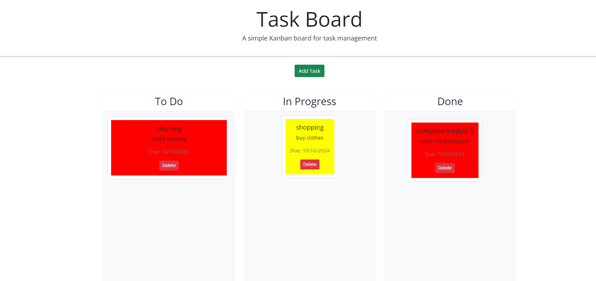

# Task Board Project

## Description

The Task Board project is a simple Kanban-style task management application that allows users to organize and track the progress of various tasks. The motivation behind building this project was to create an interactive project management tool where tasks can be added, moved between different stages of completion, and tracked with visual cues such as color coding for approaching deadlines.

The app was built to practice using third-party APIs like jQuery UI and Day.js while also enhancing my skills in DOM manipulation and localStorage handling in JavaScript. This project solves the problem of task organization and progress tracking, allowing users to visually manage their to-do lists with drag-and-drop functionality.

### Key Features:
- Add new tasks with a title, description, and due date.
- Tasks are displayed in three columns: "To Do", "In Progress", and "Done".
- Drag-and-drop tasks between columns to update their progress.
- Tasks are color-coded based on their due dates (yellow for approaching deadlines, red for overdue).
- Tasks persist in localStorage so they are available even after refreshing the page.

## Table of Contents

- [Installation](#installation)
- [Usage](#usage)
- [Credits](#credits)
- [License](#license)

## Installation

To install and run this project locally, follow these steps:

1. Clone the repository to your local machine.
    ```bash
    git clone git@github.com:Justbeingtai/task-board.git
    ```
2. Navigate to the project directory.
    ```bash
    cd task-board
    ```
3. Open the project in your preferred code editor (like VS Code).
4. Open `index.html` in your browser to start using the Task Board app.

## Usage

The Task Board app allows you to add tasks, move them between different stages of completion, and track deadlines.

1. Click on the "Add Task" button to open the task creation modal.
2. Fill in the task details, including the title, description, and due date, and click "Save Task."
3. Your task will appear under the "To Do" column.
4. Drag and drop tasks between "To Do", "In Progress", and "Done" columns to update their status.
5. Tasks will be saved in localStorage and will remain on the board even after refreshing the page.

### Screenshot:



## Credits

- [jQuery](https://jquery.com/)
- [jQuery UI](https://jqueryui.com/)
- [Day.js](https://day.js.org/)
- [Bootstrap](https://getbootstrap.com/)

Special thanks to the instructional team and the resources provided throughout the development of this project.

## License

This project is licensed under the MIT License. For more information, check the LICENSE file or visit [https://choosealicense.com/](https://choosealicense.com/).

---

## Badges


## Features

- Task color-coding based on deadlines.
- Draggable task cards for easy progress management.
- Persistent task storage using localStorage.

## How to Contribute

Contributions are welcome! If you'd like to contribute to this project, feel free to fork the repo and submit a pull request with your improvements or suggestions.

## Tests

No tests have been implemented for this project yet, but future updates may include unit tests for task creation and localStorage functionality.
